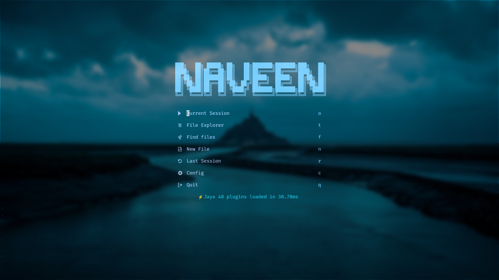

# Jayadeep's dotfiles

## desktop


## kitty


## neovim



# Arch Linux

#### Install git

before insallation it will update the system
```
sudo pacman -Syu git 
```

#### install packages
```
sudo pacman -S hyprland swww sddm kitty neovim neofetch 
```

#### Clone repo
```
git clone git@github.com:JayaDeep11/dotfiles.git
```
