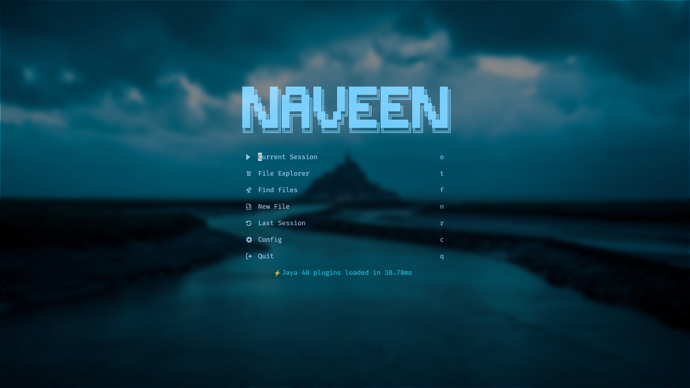
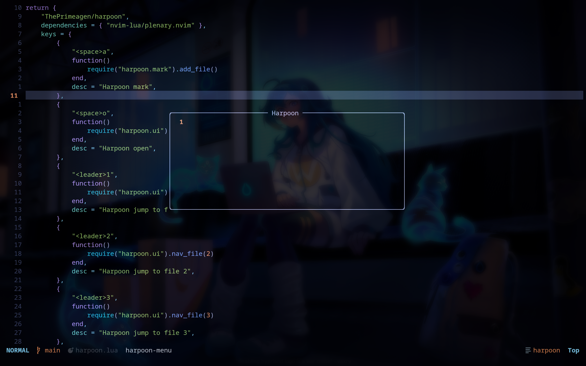
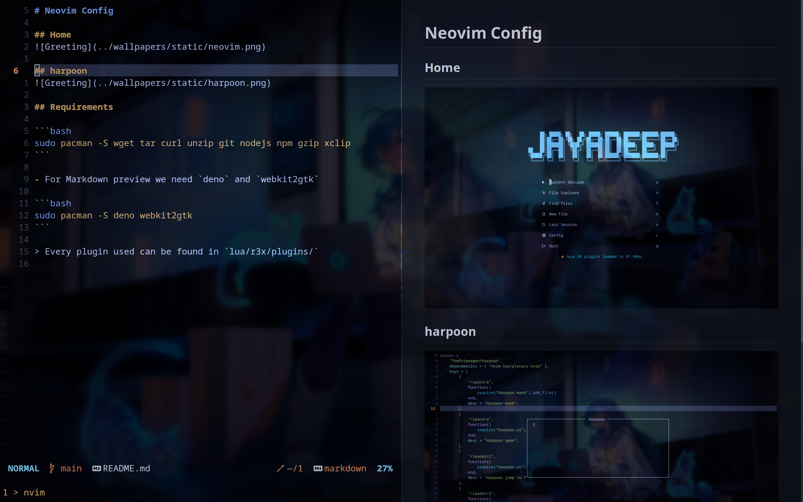

# Neovim Config

## Home


## harpoon


## deno

## Requirements


```bash
sudo pacman -S wget tar curl unzip git nodejs npm gzip xclip 
```

- For Markdown preview we need `deno` and `webkit2gtk`

```bash
sudo pacman -S deno webkit2gtk
```

> Every plugin used can be found in `lua/jaya/plugins/`
